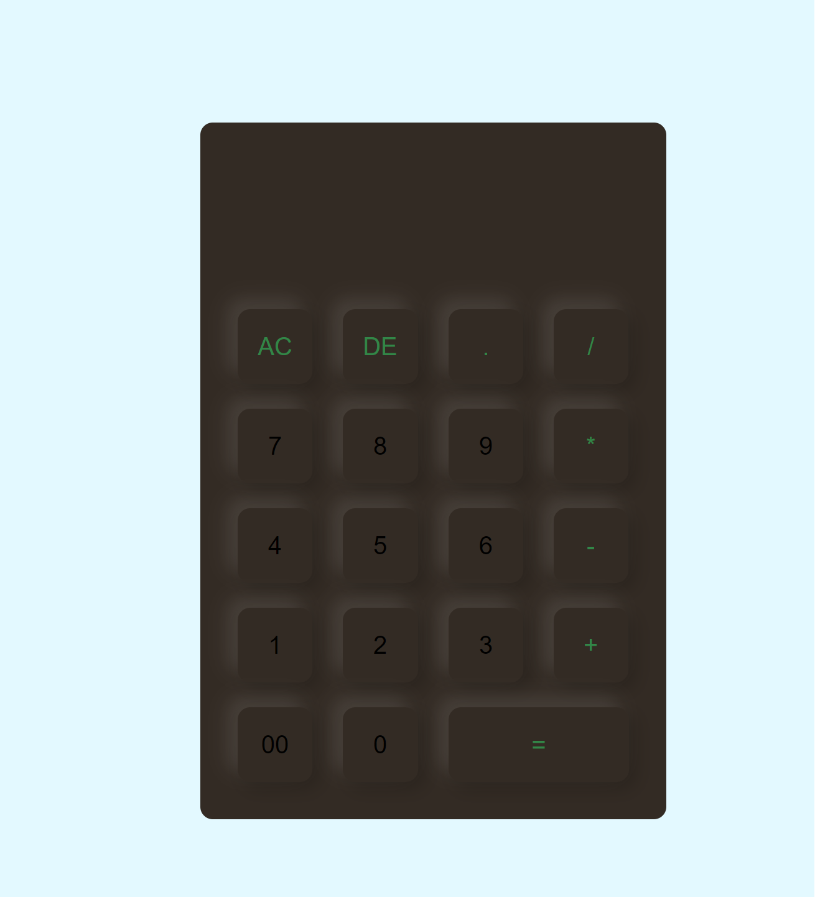

# Simple JavaScript Calculator

A straightforward calculator built using HTML, CSS, and JavaScript for basic arithmetic operations.

## Features

- Addition, subtraction, multiplication, and division functionality.
- Clear button to reset the calculator.
- Responsive design for seamless usage on various devices.

## Screenshots

  <!-- Add a screenshot of your calculator -->

## How to Use

1. Clone the repository: `git clone https://github.com/SridharRenangi/calculator.git`
2. Open `index.html` in your browser.

## Contributing

Feel free to contribute by opening issues or sending pull requests. Any improvements or bug fixes are highly appreciated.
